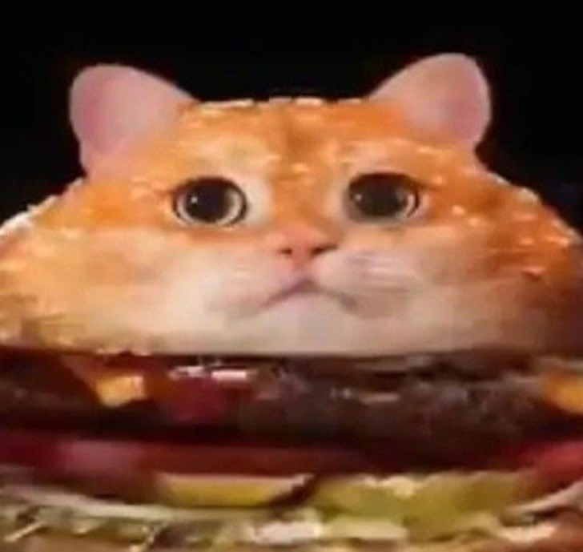

# GatoBurguer

## What's this?
Basic YouTube Bot for Discord!

## Features
- YouTube Support!
- Fully selfhostable!

## Setup
- Install [Node.JS](https://nodejs.org/en/download)
- Clone the repository
- Install dependencies with ``npm install``
- Set your bot token
- Start the bot with ``npm start``
